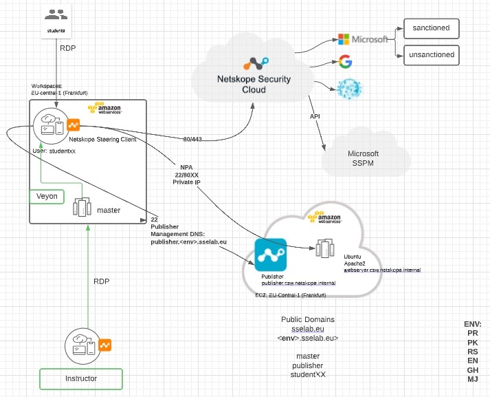

**<h1> Netskope Cloud Security Workshop automation through Terraform Workspaces </h1>**

  IAM credentials and environmental access will be provided by the DACH netskope team / Phil Rumi<br>
  **SLACK: #netskope-csw** with all pinned information and howto

--- 

This terraform module creates Netskope Hands On Lab Environment with predefined custom student images that contain neccessary configuration parameters for the lab

terraform works with so called workspaces, so you can switch into individual "working environments". One can create multiple lab environments in different workingspaces at the same time.

Every workspace creates a DNS subzone of sselab.eu in the initials of the individual instructor

terraform.state will be saved on remote S3 buckets with versioning, encryption enabled in DynamoDB

---

**You can use a predefined docker container containing all relevant binaries like terraform, awscli and Make to simply spin up this environment. <br> As we use a shared AWS environment with subdomains for external access, please reach out in SLACK for the relevant data**

Install Docker 

As the docker container mounts a local volume dir you need to have the "data" folder inside your current working directory containing the relevant terraform files (internal - pinned to the slack channel)

**to start the environment**<br>
docker run -i -t prumi88/terraform-csw:alpine make apply<br>
**to start the environment with a new publisher and token connect**<br>
docker run -i -t prumi88/terraform-csw:alpine make apply_ubuntu<br>
**to destroy the environment**<br>
docker run -i -t prumi88/terraform-csw:alpine make destroy<br>

---

**<h3>the manual way:</h3>**


**1. install packet manager**


MacOS - Install HomeBrew via /bin/bash -c "$(curl -fsSL https://raw.githubusercontent.com/Homebrew/install/HEAD/install.sh)"

Windows - https://chocolatey.org/install

**2. install packages:**

- awscli
- make
- terraform
  
**3. modify aws credentials file**
   
Create (or edit) the ~/.aws/credentials (mac) or /%USERPROFILE%\.aws\credentials (win)
 file and insert the following AWS profile

    [csw-profile]
    aws_access_key_id = <Access  Key>
    aws_secret_access_key = <Secret  Key>


**4. create a terraform.tfvars file with the provided aws credentials and put it in the working directory of the terraform scripts**

```
aws_access_key = "XXXX"
aws_secret_key = "XXXX"
aws_region     = "eu-central-1"
```

    make apply 

After running the command you will receive outputs of the created ressources containing the DNS names to access the ressources
If you do want to create a NEW publisher and connect it to your tenant via TOKEN, you can run 


```
make apply_ubuntu
```
This will ask for the $token value you can pass on while creating this publisher


**to destroy the environment**


    make destroy


**estimated infrastructure monthly cost* with 2 student PCs* 340 / 730 hours * 5 hours = **2,30 $ per Workshop**


**Public DNS access:**

- Publisher SSH: publisher."ENV".sselab.eu
- Master Instructor RDP: master."ENV".sselab.eu
- Guacamole HTTPS: guacamole."ENV".sselab.eu
- Student RDP: studentXX."ENV".sselab.eu

environments can be extended in the workspaces.tf file by copying the relevant data block using a new name

**Environment**: 


